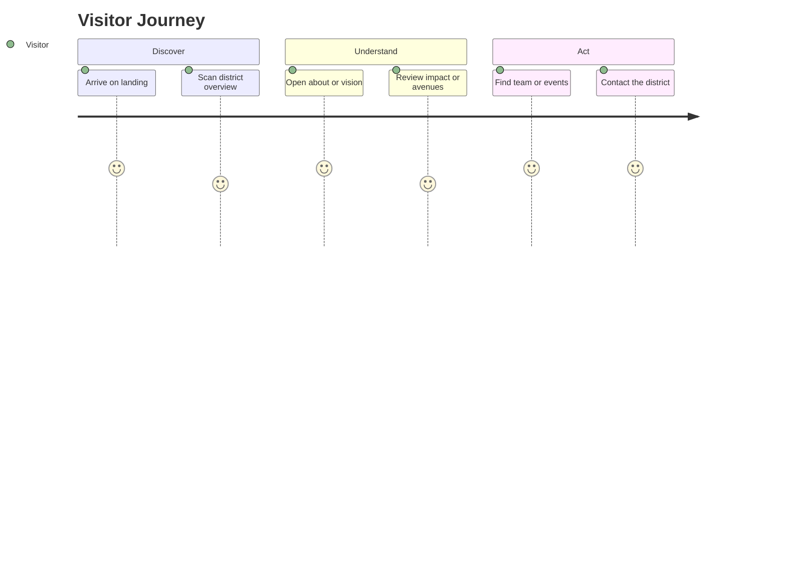

# Information Architecture

## Sitemap

```mermaid
flowchart TD
  A[Landing Experience] --> B[About District]
  A --> C[District Vision]
  A --> D[District Impact]
  A --> E[Our Avenues]
  A --> F[Meet the District Team]
  A --> G[Events]
  A --> H[Gallery]
  A --> I[Contact]
  A --> J[Footer]

  B --> B1[District Overview]
  B --> B2[Mission]
  B --> B3[Values]
  B --> B4[Structure]

  C --> C1[Goals]
  C --> C2[Strategic Direction]

  D --> D1[Programs]
  D --> D2[Statistics]
  D --> D3[Stories]

  E --> E1[Community Service]
  E --> E2[Professional Development]
  E --> E3[Leadership]
  E --> E4[Fellowship]

  F --> F1[Leadership Roles]
  F --> F2[Contact Paths]

  G --> G1[Upcoming Events]
  G --> G2[Past Events]

  H --> H1[Photo Archive]
  H --> H2[Media Collections]

  I --> I1[Contact Form]
  I --> I2[Social Links]
  I --> I3[Location Details]
```

## Landing Experience
The landing experience should provide a concise district overview and direct visitors to the most important journeys:
- Learn about the district
- Understand its vision
- Explore impact
- Find team information
- Reach contact paths

## Navigation Hierarchy
| Level | Items |
|---|---|
| Primary | About District, District Vision, District Impact, Our Avenues, Team, Events, Gallery, Contact |
| Secondary | Footer links, social links, legal links, archive links |
| Tertiary | Future CMS-driven subpages, event detail pages, archive pages |

## Section Relationships
- Landing Experience introduces the district and routes to core content.
- About District explains identity, values, and purpose.
- District Vision defines strategic direction.
- District Impact demonstrates outcomes and credibility.
- Our Avenues organizes program categories.
- Meet the District Team connects leadership to contact and accountability.
- Events and Gallery support ongoing activity and archive value.
- Contact closes the journey and provides action paths.
- Footer reinforces navigation, utility, and trust.

## User Journey

## Future Scalability
The information architecture should support:
- Dedicated detail pages for events
- District announcements
- Program pages under avenues
- Archive pages for media and publications
- Search and filtering
- CMS-managed content blocks
- Multi-language expansion

## Potential Additional Pages
| Page Type | Purpose |
|---|---|
| District archive | Preserve historical milestones and leadership records |
| Publications | Share reports, newsletters, and documentation |
| Programs detail pages | Expand each avenue into a dedicated subpage |
| Event detail pages | Provide structured event information and registration links |
| News or updates | Publish district announcements and highlights |
| FAQ | Answer common visitor questions |
| Volunteer page | Support sign-ups and participation |

## Notes on Future Navigation
Navigation should remain shallow and easy to scan. As the site grows, a balanced approach between top-level clarity and subpage depth will be necessary to preserve usability.
