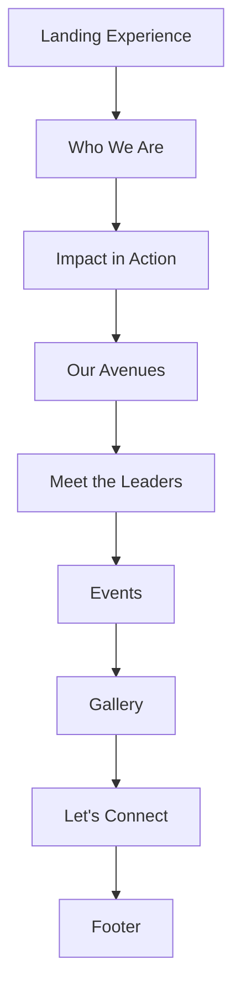

# UI Wireframes

## Purpose of This Document
This document is the master UX blueprint for the website. It is not a visual mockup and does not define implementation details in code. Instead, it translates the project vision, information architecture, content strategy, brand principles, design system, component library, and animation guide into a section-by-section planning document.

The goal is to give designers and developers a shared reference for how the website should behave, flow, and feel before any visual implementation begins.

## Experience Summary
The site should feel like a combination of Apple, Linear, Stripe, and Framer, expressed through an official Rotaract District lens. The experience should be premium, calm, and precise, with motion used to create clarity and continuity rather than spectacle.

The inspiration from the Framer Nudge template is about interaction philosophy only:
- high-quality pacing
- confident spacing
- subtle movement
- tactile hover behavior
- strong hierarchy
- light editorial storytelling

It should not copy structure, content, or visual identity from the template.

## Structural Principles
- The site should tell one continuous story.
- Sections should feel connected, not isolated.
- Motion should create anticipation between sections.
- Content should be scannable on first view and meaningful on deeper reading.
- Every section should have a clear job.
- Every interaction should reinforce trust or usability.
- All layouts should be reusable, responsive, and accessible.

## Global Wireframe Rules
| Rule | Description |
|---|---|
| Max width | Use the shared container system from the design system. |
| Rhythm | Preserve vertical consistency between sections. |
| Contrast | Keep text and surfaces readable across light and dark token states. |
| Motion | Use restrained, purposeful motion only. |
| Interactions | Hover, magnetic, reveal, parallax, and cursor-aware behaviors should remain subtle. |
| Accessibility | Keyboard and reduced-motion support are required. |
| Scalability | Every section should be built so it can expand into CMS-driven content later. |

---

# 1. Landing Experience

## Purpose
The landing experience introduces the district immediately and establishes credibility, clarity, and momentum.

What visitors should understand after viewing it:
- This is the official Rotaract District 3141 website.
- The district is active, organized, and community-driven.
- There are clear entry points into the rest of the site.

## Layout Structure
- Sticky navigation at the top.
- Full-width hero with centered or slightly offset content.
- Floating stickers placed around the hero composition.
- Grid background behind the primary content plane.
- Scroll indicator near the lower edge of the viewport.
- Mouse-aware layers that create mild depth without distraction.
- A clear CTA cluster directly beneath or beside the main statement.

Recommended layout direction:
- Desktop: split composition with text, supporting marks, and floating elements.
- Tablet: stacked but still editorial.
- Mobile: vertically compact, with stickers reduced and content prioritized.

## Content Hierarchy
1. Navigation
2. Logo
3. Main heading
4. Supporting heading
5. CTA buttons
6. Floating stickers
7. Credibility markers or quick facts
8. Scroll indicator
9. Mouse interaction layer
10. Grid background

## Interaction Design
- Navigation links should animate on hover.
- Logo should support the full morph interaction pattern.
- CTAs should feel magnetic or tactile on hover.
- Floating stickers should drift slightly and respond to movement.
- The cursor should subtly invert or react near interactive targets.
- Mouse movement should create very light parallax across layered elements.
- Scroll indicator should guide the user without drawing excessive attention.

## Animation Behaviour
| State | Behaviour |
|---|---|
| Entrance | Hero content fades in with slight upward motion and staggered sequence. |
| Hover | CTAs, logo, and stickers respond with subtle lift or scale. |
| Scroll | Background and sticker layers can drift or soften as the user advances. |
| Exit | The section should transition into the next block without a hard stop. |
| Duration | Keep timing smooth and concise, aligned to the design system tokens. |
| Purpose | Establish momentum and confidence at first contact. |

## Spacing
- The hero should breathe generously.
- Use large top and bottom padding.
- Maintain a clear visual center with enough negative space for stickers.
- Keep CTA spacing comfortable and not crowded.
- The container should remain aligned to the shared site width.

Approximate approach:
- Desktop: expansive vertical padding with substantial internal gaps.
- Mobile: reduce excess height but preserve the premium feel.

## Responsive Behaviour
### Desktop
- Full hero composition visible.
- Floating stickers occupy balanced peripheral positions.
- Grid background has enough room to feel intentional.

### Tablet
- Reduce the number of visible decorative elements.
- Keep the headline dominant.
- Maintain CTA clarity and spacing.

### Mobile
- Stack content vertically.
- Reduce sticker count or compress them into simpler placements.
- Keep the logo, headline, CTA, and scroll cue first.

## Accessibility
- Navigation should be keyboard-accessible.
- CTA labels must be explicit.
- Color contrast must remain strong.
- Cursor effects must not replace visible focus states.
- Reduced-motion users should receive a calmer static version.
- ARIA should be used where icon-only or decorative elements appear.

## Future Expansion
- CMS-managed hero copy and stats
- Event or campaign-specific landing variants
- Hero media integration
- Rotating district highlights
- Seasonal or year-based editions

---

# 2. Who We Are

## Purpose
This section explains the district identity, mission, vision, and core values.

What visitors should understand after viewing it:
- The district exists to serve, lead, and organize community action.
- The organization has a clear purpose and long-term direction.
- The district has a human, structured, and trustworthy identity.

## Layout Structure
- Split layout or carefully staggered stacked content.
- One side may hold narrative content while the other supports mission, vision, and values.
- Cards or list blocks can be used for values.
- A visual support area can later house a district map or abstract visual.

Recommended layout direction:
- Desktop: left/right split or asymmetrical grid.
- Tablet: two-column collapse into stacked rows.
- Mobile: single-column sequence with clear typographic hierarchy.

## Content Hierarchy
1. Eyebrow
2. Section heading
3. Supporting text
4. Mission
5. Vision
6. Core values
7. Supporting visual or statistics
8. CTA

## Interaction Design
- Section heading reveal should feel calm and controlled.
- Values can appear as cards that slightly lift on hover.
- If a future map or visual element is added, it should move subtly with the cursor or scroll.
- Links and CTAs should remain magnetic and tactile.
- Transitions between sub-parts should feel editorial rather than abrupt.

## Animation Behaviour
| State | Behaviour |
|---|---|
| Entrance | Heading and mission content reveal first, followed by supporting values. |
| Hover | Values or cards respond with gentle elevation or border emphasis. |
| Scroll | Elements can reveal sequentially to support narrative flow. |
| Exit | The section should fade into the next narrative block. |
| Duration | Moderate and calm; avoid making the section feel busy. |
| Purpose | Build trust through clarity and structured storytelling. |

## Spacing
- Use generous separation between mission, vision, and values.
- Maintain a strong vertical rhythm.
- Keep card gaps comfortable on all viewports.
- Avoid clustering too much text in a single block.

## Responsive Behaviour
### Desktop
- Split layout is preferred.
- Values may be shown in a card grid.
- Supporting visuals can occupy the secondary column.

### Tablet
- Stack the split layout with preserved hierarchy.
- Values should remain scannable in two columns if possible.

### Mobile
- Everything becomes a single column.
- Mission, vision, and values should remain separately legible.
- Remove any complex supporting visuals if they compromise readability.

## Accessibility
- Use semantic heading levels.
- Use list semantics for values where appropriate.
- Ensure cards and controls are keyboard navigable.
- Maintain clear contrast for body text and captions.
- Respect reduced-motion preferences.

## Future Expansion
- Add district history timelines
- Add leadership summaries
- Connect to CMS-driven mission and vision blocks
- Expand into a full district profile page

---

# 3. Impact in Action

## Purpose
This section demonstrates the district’s activity, outcomes, and credibility through statistics, counters, featured initiatives, and impact cards.

What visitors should understand after viewing it:
- The district is active and measurable.
- The work produces visible community outcomes.
- The website can present impact with confidence and authority.

## Layout Structure
- Dark or high-emphasis section.
- Statistics displayed as a structured grid or counter row.
- Featured initiatives arranged as cards.
- Supporting narrative may sit above or beside the metrics.

Recommended layout direction:
- Desktop: stat strip plus layered cards.
- Tablet: two-column stat cards and one featured block.
- Mobile: vertical stack with compact counters.

## Content Hierarchy
1. Eyebrow
2. Heading
3. Supporting text
4. Animated counters
5. Statistics
6. Featured initiatives
7. Impact cards
8. CTA

## Interaction Design
- Counters should animate into place as the section enters view.
- Cards should lift subtly on hover.
- Interactive emphasis should remain on the data, not decoration.
- Mouse-aware effects should be minimal but present on highlight surfaces.
- Any future graphs should reveal progressively rather than abruptly.

## Animation Behaviour
| State | Behaviour |
|---|---|
| Entrance | Counters increment and cards reveal in staggered sequence. |
| Hover | Cards gain slight elevation, glow, or border emphasis. |
| Scroll | Stat groups can pin briefly or reveal in measured steps if needed. |
| Exit | Motion should taper cleanly into the next section. |
| Duration | Crisp enough to communicate momentum, but never flashy. |
| Purpose | Make evidence of impact feel dynamic and trustworthy. |

## Spacing
- Use strong separation between metrics and initiative cards.
- Keep card padding generous.
- Maintain a dark-section structure with readable spacing.
- Use aligned columns so statistics feel ordered.

## Responsive Behaviour
### Desktop
- Wide stat row or card grid.
- Feature cards can sit in a secondary grid.

### Tablet
- Compress stats into two columns.
- Maintain readable card spacing.

### Mobile
- Stack counters vertically or in a two-column grid.
- Keep numbers prominent.
- Avoid overcrowding with too many card elements at once.

## Accessibility
- Animated numbers should remain readable without animation.
- Provide accessible labels for statistics.
- Ensure dark-section contrast is strong enough for all text.
- Avoid using motion as the only way to communicate the metric.

## Future Expansion
- API-fed metrics
- Live district stats
- Filtered initiative categories
- Impact story archives
- Interactive graphs and charts

---

# 4. Our Avenues

## Purpose
This section organizes the district’s areas of activity into interactive avenue cards.

What visitors should understand after viewing it:
- The district supports multiple programs or pathways.
- Each avenue has a distinct purpose but belongs to one larger ecosystem.
- The site can grow into structured program pages later.

## Layout Structure
- Grid of interactive avenue cards.
- Each card can expand, reveal, or preview content.
- Future content can use accordions or drill-down panels.
- The layout should feel like a structured index rather than a dense list.

Recommended layout direction:
- Desktop: multi-column card grid.
- Tablet: two-column grid.
- Mobile: single-column stack with compact expansion.

## Content Hierarchy
1. Eyebrow
2. Heading
3. Supporting text
4. Avenue cards
5. Expandable detail area
6. CTA

## Interaction Design
- Cards should react to hover with subtle lift and border changes.
- Expansion should feel controlled and elegant.
- Cursor proximity can slightly intensify the active card.
- If future content is nested, the expansion should preserve context.
- CTA should guide users toward participation or deeper reading.

## Animation Behaviour
| State | Behaviour |
|---|---|
| Entrance | Cards stagger in and establish the visual grid. |
| Hover | Each card lifts, increases contrast, or shifts surface tone. |
| Expand | Content reveals with smooth height and opacity transitions. |
| Exit | Section should close with consistent rhythm and no abrupt cut. |
| Duration | Medium and precise; expansion must feel controlled. |
| Purpose | Make program categories feel approachable and organized. |

## Spacing
- Keep card padding substantial.
- Use even gaps between cards.
- Expansion areas need enough internal space to remain readable.
- The section should feel structured and balanced.

## Responsive Behaviour
### Desktop
- Multiple cards visible at once.
- Expansion can happen in-place or within a side panel.

### Tablet
- Maintain card consistency with slightly fewer columns.
- Expansion should not obscure too much context.

### Mobile
- Use a vertical accordion or stacked cards.
- Preserve tap targets and expand/collapse clarity.

## Accessibility
- Expansion controls must be keyboard accessible.
- Active states must be visually clear.
- Use ARIA attributes for collapsible content.
- Ensure focus states remain visible across cards and controls.

## Future Expansion
- Avenue detail pages
- CMS-managed avenue descriptions
- Filter and search controls
- Program-specific subnavigation

---

# 5. Meet the Leaders

## Purpose
This section introduces the district leadership structure, including the District Representative, executive committee, executive chairs, and council members.

What visitors should understand after viewing it:
- Leadership is organized and transparent.
- There is a clear hierarchy and responsibility structure.
- Users can identify the appropriate contact path.

## Layout Structure
- Hierarchical layout with visual grouping.
- Top-level leadership featured first.
- Secondary roles grouped below.
- A structure visualization or role map can support understanding.

Recommended layout direction:
- Desktop: hierarchy diagram or layered card system.
- Tablet: stacked role groups with visual connectors.
- Mobile: sequential role blocks with clear headings.

## Content Hierarchy
1. Eyebrow
2. Heading
3. Supporting text
4. District Representative
5. Executive Committee
6. Executive Chairs
7. Council Members
8. Hierarchy visualization
9. CTA or contact route

## Interaction Design
- Role cards should respond to hover with subtle emphasis.
- Hierarchy visualization should feel lightweight and editorial.
- If profile cards expand later, the expansion should remain calm and readable.
- Cursor interactions should be minimal and professional.

## Animation Behaviour
| State | Behaviour |
|---|---|
| Entrance | Leadership groups reveal top-down to reinforce hierarchy. |
| Hover | Profiles gain subtle elevation or border accent. |
| Scroll | Groups can appear sequentially to help reading order. |
| Exit | Transition should maintain the sense of structure. |
| Duration | Medium and respectful; leadership content should not feel playful. |
| Purpose | Present accountability and organization clearly. |

## Spacing
- Separate role groups clearly.
- Keep leader cards aligned and readable.
- Use enough gap to distinguish top-level roles from supporting roles.
- Avoid compressing the hierarchy too tightly.

## Responsive Behaviour
### Desktop
- Full hierarchy may appear in a diagram or multi-column arrangement.
- Cards can be larger and more detailed.

### Tablet
- Reduce diagram complexity while keeping hierarchy clear.

### Mobile
- Stack by role importance.
- Preserve clear labels and avoid overloading each card.

## Accessibility
- Use semantic headings per role group.
- Ensure profile content is keyboard accessible.
- Provide meaningful alt text for portraits.
- Keep color contrast consistent across avatar and card surfaces.

## Future Expansion
- Team CMS
- Leadership bios
- Direct contact routing
- Role-specific detail pages
- Archived leadership history

---

# 6. Events

## Purpose
The events section showcases upcoming, past, and featured activities in a timeline-oriented format.

What visitors should understand after viewing it:
- The district is active throughout the year.
- Events are organized and archival.
- Users can find current participation opportunities and past highlights.

## Layout Structure
- Featured event at the top or side.
- Upcoming and past events separated by clear states.
- Timeline or chronological structure preferred.
- Optional cards for quick scanning.

Recommended layout direction:
- Desktop: featured block plus timeline/grid.
- Tablet: stacked featured card and event list.
- Mobile: single-column timeline with compact cards.

## Content Hierarchy
1. Eyebrow
2. Heading
3. Supporting text
4. Featured event
5. Upcoming events
6. Past events
7. Timeline markers
8. CTA

## Interaction Design
- Event cards should elevate on hover.
- Timeline markers should indicate state and chronology.
- Expandable summaries may reveal more details.
- CTA should connect to registration or archive routes.

## Animation Behaviour
| State | Behaviour |
|---|---|
| Entrance | Featured event appears first, followed by chronological items. |
| Hover | Event cards lift slightly and sharpen in emphasis. |
| Scroll | Timeline can reveal section-by-section as the user moves down. |
| Exit | Should hand off smoothly into gallery or contact content. |
| Duration | Moderate and orderly. |
| Purpose | Make events feel current, structured, and easy to scan. |

## Spacing
- Separate featured and list content clearly.
- Use enough vertical spacing between event entries.
- Timeline markers need breathing room.
- Preserve readability on small screens.

## Responsive Behaviour
### Desktop
- Larger featured event and visible event list or timeline.

### Tablet
- Condense into a strong vertical narrative.

### Mobile
- Stack events in simple chronology.
- Keep action labels visible and accessible.

## Accessibility
- Event dates should be text-readable and not image-dependent.
- Use clear focus states on interactive event elements.
- Ensure list semantics are preserved.
- Use descriptive labels for status tags.

## Future Expansion
- Event detail pages
- Registration integration
- Filter by event type or status
- Calendar sync
- Archive search

---

# 7. Gallery

## Purpose
The gallery preserves visual memory of the district and supports image-based storytelling.

What visitors should understand after viewing it:
- The district has a visible history of participation.
- The website can present media in an organized, premium way.
- Photos are part of the district’s archival identity.

## Layout Structure
- Masonry or editorial image grid.
- Featured images may appear larger than others.
- Hover interactions should hint at caption or detail availability.
- Lightbox support should be planned for future use.

Recommended layout direction:
- Desktop: masonry or mixed-size grid.
- Tablet: balanced grid with fewer columns.
- Mobile: single-column or two-column tiles.

## Content Hierarchy
1. Eyebrow
2. Heading
3. Supporting text
4. Gallery grid
5. Captions or metadata
6. Lightbox trigger
7. CTA

## Interaction Design
- Hover should reveal caption, category, or date context.
- Tile movement should be minimal and refined.
- Future lightbox interaction should feel smooth and focused.
- Cursor-aware emphasis can be subtle for image targets.

## Animation Behaviour
| State | Behaviour |
|---|---|
| Entrance | Images reveal in staggered groups or rows. |
| Hover | Images slightly scale or shift with caption reveal. |
| Lightbox open | Focus should move into a controlled viewing state. |
| Exit | Close transitions should be smooth and premium. |
| Duration | Light and responsive, never jarring. |
| Purpose | Make media feel curated and archival. |

## Spacing
- Use clear gutter spacing.
- Avoid cramped image tiles.
- Leave room for captions and overlays.
- Keep the grid balanced and calm.

## Responsive Behaviour
### Desktop
- Masonry or editorial grid with varied tile sizes.

### Tablet
- Reduce complexity while preserving visual rhythm.

### Mobile
- Use a simplified grid with manageable touch targets.
- Avoid overly complex aspect ratio shifts.

## Accessibility
- All images need descriptive alt text.
- Captions should be readable and not hover-only if content is important.
- Lightbox controls must be keyboard accessible.
- Focus states should be visible in modal mode.

## Future Expansion
- Gallery albums
- Lightbox viewer
- Filter by event or year
- CMS-driven media metadata
- Download or share options

---

# 8. Let's Connect

## Purpose
This section gives visitors a clear path to contact the district, view official information, and follow social channels.

What visitors should understand after viewing it:
- The district is reachable and responsive.
- There is an official route for inquiries.
- The website can support maps, forms, and social links cleanly.

## Layout Structure
- Contact form area.
- District details and contact block.
- Map or location support area.
- Social link cluster.

Recommended layout direction:
- Desktop: split layout between form and info panel.
- Tablet: stacked but still clearly separated.
- Mobile: one-column flow with form first or info first based on priority.

## Content Hierarchy
1. Eyebrow
2. Heading
3. Supporting text
4. Contact form
5. District details
6. Map
7. Social links
8. CTA

## Interaction Design
- Form fields should feel premium and focus-aware.
- Buttons should be magnetic or tactile.
- Social links should have hover feedback.
- Map area should remain understated and not dominate the section.

## Animation Behaviour
| State | Behaviour |
|---|---|
| Entrance | Form and info blocks reveal with subtle stagger. |
| Hover | Buttons and social items react with restrained emphasis. |
| Scroll | The map or contact details may appear after the form. |
| Exit | Transition should lead naturally into footer content. |
| Duration | Smooth, practical, and calm. |
| Purpose | Reduce friction in reaching the district. |

## Spacing
- Maintain good form spacing for readability and tap targets.
- Separate map and form clearly.
- Use predictable vertical rhythm.
- Keep social links spaced for scanning and tapping.

## Responsive Behaviour
### Desktop
- Two-column split works best.
- Map can occupy a secondary panel.

### Tablet
- Stack with distinct sections.
- Maintain form clarity and simple information flow.

### Mobile
- Prioritize form labels and contact details.
- Keep map lightweight or simplified.
- Preserve adequate spacing for touch interaction.

## Accessibility
- Every form field must have a label.
- Validation errors need clear messaging.
- Social links must have descriptive names.
- Map content should not block keyboard navigation.
- Focus styles must be obvious.

## Future Expansion
- CMS-managed contact details
- Form submission integration
- Location map enhancement
- Additional contact departments
- Office hours or event support routes

---

# 9. Footer

## Purpose
The footer closes the experience and provides secondary navigation, legal context, social links, and credits.

What visitors should understand after viewing it:
- The site is official and complete.
- Important utility links remain accessible.
- The district presence extends beyond the main content.

## Layout Structure
- Multi-column or compact stacked footer.
- Navigation links grouped by purpose.
- Legal and credits separate from social links.
- Optional mini logo or district mark at the top of the footer cluster.

Recommended layout direction:
- Desktop: structured multi-column layout.
- Tablet: reduced columns with strong grouping.
- Mobile: stacked groups with clear hierarchy.

## Content Hierarchy
1. Brand or district identity
2. Navigation
3. Legal
4. Credits
5. Social links
6. Small closing note or copyright

## Interaction Design
- Links should have subtle hover transitions.
- Social icons should respond with gentle emphasis.
- Footer should feel like a closing page anchor rather than a utility dump.

## Animation Behaviour
| State | Behaviour |
|---|---|
| Entrance | Footer content appears as the final chapter of the story. |
| Hover | Links and icons respond with light emphasis. |
| Scroll | Footer remains stable and calm to signal closure. |
| Exit | Should not feel animated away aggressively. |
| Duration | Minimal and professional. |
| Purpose | Reinforce completeness and official structure. |

## Spacing
- Use generous footer padding.
- Separate link groups clearly.
- Preserve a calm and final rhythm.

## Responsive Behaviour
### Desktop
- Multiple grouped columns.
- Clear separation between navigation and utility links.

### Tablet
- Reduce columns as needed while retaining clarity.

### Mobile
- Stack groups vertically.
- Ensure link tap targets remain comfortable.

## Accessibility
- Footer links must be keyboard accessible.
- Legal text should remain readable.
- Social links need accessible labels.
- Avoid low-contrast text in the footer area.

## Future Expansion
- Dynamic footer navigation
- Legal or policy updates
- Additional social channels
- Partner acknowledgments
- CMS-driven footer content

---

# 10. Section Transitions

## Overview
The site should feel like one continuous story rather than a set of isolated blocks. Each section should hand off to the next with consistent rhythm, shared spacing logic, and motion that preserves momentum.

## Transition Principles
- Each section should introduce the next idea.
- Exit content should resolve before the next section fully enters.
- Use background, spacing, or motion shifts to indicate narrative change.
- Avoid hard visual breaks unless they serve a strong semantic purpose.
- Maintain continuity through shared layout width and consistent timing.

## Flow Model


## Recommended Transition Patterns
| Transition Type | Use Case |
|---|---|
| Soft fade | Between calm editorial sections |
| Stagger continuation | Between narrative and support content |
| Background shift | When moving from light to dark emphasis blocks |
| Spatial compression | When entering denser grids or lists |
| Motion continuity | When moving from hero elements to supporting cards |

## Narrative Continuity
- Landing Experience creates curiosity.
- Who We Are establishes identity.
- Impact in Action proves credibility.
- Our Avenues explains how the district operates.
- Meet the Leaders adds structure and accountability.
- Events creates immediacy and participation.
- Gallery preserves memory and proof.
- Let's Connect offers a final route to action.
- Footer closes the journey clearly.

## Transition Accessibility
- Transitions must not hide content from assistive technology.
- Avoid motion-only changes that communicate critical meaning.
- Respect reduced motion preferences with simplified handoffs.

---

# 11. Signature Interactions

## Overview
These interactions define the website’s unique identity. They should feel premium, restrained, and memorable without becoming distracting.

## Interaction System

### Logo Morph
- Circle to rounded square to color inversion.
- The logo should respond to hover and cursor proximity.
- It should feel like a signature brand gesture rather than a gimmick.

### Living Floating Stickers
- Stickers should feel present but light.
- They may drift, rotate, and float gently.
- Hover lift should feel tactile.
- Glass variants can be used sparingly.

### Intelligent Grid
- The grid should feel like a subtle organizing field.
- It should support depth without making the page busy.
- The grid can react softly to section changes or cursor position.

### Magnetic Buttons
- Primary CTAs and important actions should feel slightly pull-aware.
- Strength should remain low and elegant.
- The effect should reinforce usability and tactility.

### Mouse-aware Elements
- Key surfaces can shift subtly with pointer movement.
- The effect should be layered and quiet.
- It should never interrupt reading.

### Smooth Scroll Storytelling
- Scrolling should feel continuous and controlled.
- Each section should appear as a chapter of the same narrative.
- Momentum should carry through the site without feeling slippery.

### Premium Page Loader
- Loader behavior should be minimal and refined.
- It should feel like a readiness state, not a waiting state.
- The loader should reinforce brand polish.

## Interaction Rules
- Do not stack too many interactions on one element.
- Keep the visual center of gravity on content.
- Make hover, scroll, and motion behaviors consistent across the system.
- Use interaction only where it improves understanding or tactility.

## Interaction Accessibility
- Provide focus equivalents for hover states.
- Reduce or disable motion when requested.
- Ensure the cursor never becomes the only indicator of affordance.
- Avoid hidden information that can only be revealed by hover.

## Future Expansion
- Cursor state variations
- Context-aware motion themes
- Section-specific interaction modes
- Seasonal branding interactions
- Event-specific motion treatments

---

# 12. Implementation Order

## Development Checklist
Create the website in the following order to reduce rework and keep dependencies stable.

```text
Foundation
  ↓
Navbar
  ↓
Landing Experience
  ↓
Who We Are
  ↓
Impact in Action
  ↓
Our Avenues
  ↓
Meet the Leaders
  ↓
Events
  ↓
Gallery
  ↓
Let's Connect
  ↓
Footer
  ↓
Polish
  ↓
Performance
  ↓
Deployment
```

## Checklist Details

### Foundation
- Confirm tokens, utilities, and shared component patterns.
- Verify typography, spacing, and responsive rules.
- Finalize accessibility baseline.

### Navbar
- Build the top navigation shell.
- Confirm logo behavior and menu responsiveness.

### Landing Experience
- Build the hero, stickers, grid, cursor, and CTA structure.
- Validate the opening narrative and first-impression quality.

### Who We Are
- Implement the district introduction and mission blocks.
- Verify the narrative balance and visual clarity.

### Impact in Action
- Add metrics, counters, and featured initiatives.
- Ensure statistical presentation is clear and credible.

### Our Avenues
- Build avenue cards and expansion behavior.
- Ensure the content model supports future growth.

### Meet the Leaders
- Add leadership hierarchy and profile presentation.
- Confirm role clarity and contact pathways.

### Events
- Implement upcoming, featured, and past event structure.
- Verify timeline or grouped list presentation.

### Gallery
- Add image grid, hover states, and lightbox planning.
- Confirm media organization and accessibility.

### Let's Connect
- Build the contact form and district information area.
- Ensure map and social links behave properly.

### Footer
- Add secondary navigation, legal, credits, and social links.
- Confirm closure and completeness.

### Polish
- Refine motion, spacing, and responsiveness.
- Adjust visual balance and section transitions.

### Performance
- Review animation cost, image strategy, and bundle impact.
- Optimize for smooth rendering and scroll behavior.

### Deployment
- Confirm build readiness.
- Validate metadata, previews, and production configuration.

## Dependency Notes
- Design system must exist before section implementation.
- Component library should be stable before page assembly.
- Content strategy should guide all copy placement.
- Animation rules should be finalized before advanced motion work.

## Final Implementation Principles
- Build from shared tokens and reusable primitives.
- Keep the site modular and future-ready.
- Avoid implementation shortcuts that weaken maintainability.
- Use the documentation set as the source of truth.
